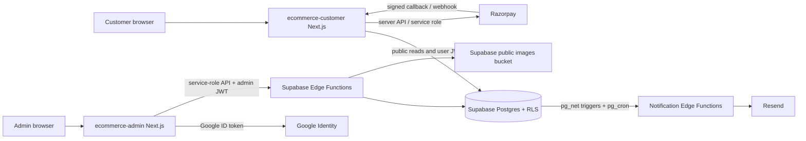
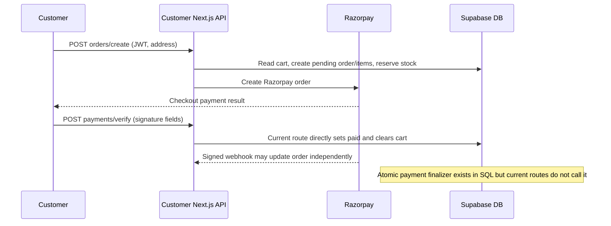
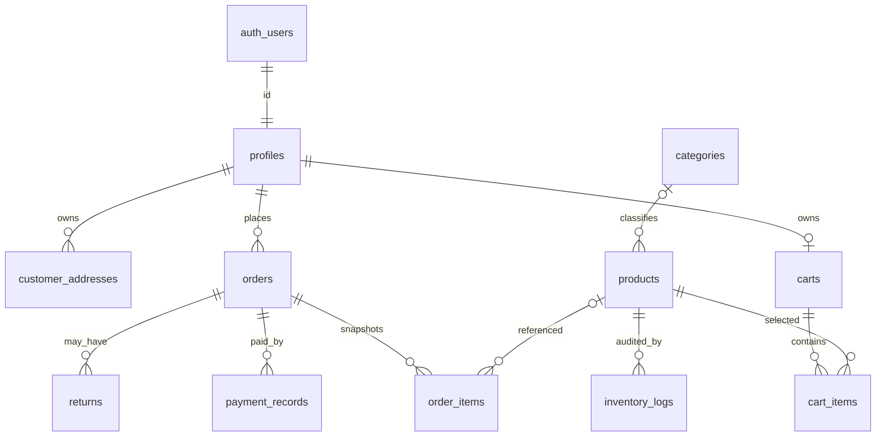

# E-commerce App: Codebase Knowledge

**Purpose:** A practical architecture and change-safety guide for the two Next.js applications and their shared Supabase backend. This document describes inspected repository behavior, not a proposed redesign. File links are relative to the repository root. The checked-in `.env.local` was intentionally not opened or copied into this document.

**Evidence boundary:** The repository has no obvious test directory in the indexed source tree. Findings below are based on direct inspection of app routes, UI entry points, SQL migrations, edge functions, package manifests, and deployment configuration. For ambiguous/conflicting implementations, this guide names both paths and does not assume which was intended to win.

## 1. High-Level Overview

### Product and users

The root README describes an e-commerce system for small-to-medium businesses. It is split into two independently served Next.js 14 applications in a pnpm workspace:

- `ecommerce-customer/` serves shoppers: public catalog, guest and authenticated carts, email/password customer auth, address book, INR checkout through Razorpay, and order history/details.
- `ecommerce-admin/` serves store operators: Google sign-in gated by an `admins` allow-list, operational dashboard/export, and product/category/stock management.
- `supabase/` owns PostgreSQL tables, RLS, RPCs, cron/trigger automation, and Deno Edge Functions for catalog operations, notifications, media, and an additional Stripe webhook path.

The business loop is: publish catalog and maintain stock -> shopper browses and checks out -> payment is associated with an order -> operators monitor sales/stock -> database events trigger customer/admin messages. The actual implementation has two competing payment flows, described in Sections 3 and 4.

### Stack

| Area | Evidence and role |
|---|---|
| Workspace | pnpm workspaces: root `package.json`, `pnpm-workspace.yaml`; only the two Next apps are workspace packages. |
| Web | Next.js 14, React 18, JavaScript/JSX; customer runs on port 3001, admin on 3000. See each app `package.json`. |
| Data/auth | Supabase JS v2 and Supabase Auth; PostgreSQL RLS is the user-data boundary. Server-only service-role clients bypass RLS. |
| Admin API | Next route handlers, `jsonwebtoken`, Google `google-auth-library`; catalog mutations/listing are Supabase Deno Edge Functions. |
| Payments | Customer app uses Razorpay (INR); `supabase/functions/stripe-webhook/` is an additional Stripe integration and is not wired to the customer app's current checkout UI. |
| Messaging/storage | Resend for email; Supabase Storage public `images` bucket for catalog images; optional push/SMS HTTP provider. |
| Deploy | Vercel-oriented app configs/docs; GitHub Actions deploys Supabase migrations and functions on pushes changing `supabase/**`; Docker Compose exposes both apps locally. |

### Feature/business map

| Feature | Business purpose | Primary implementation |
|---|---|---|
| Public product discovery | Turn the published assortment into browsable/searchable products, support price comparison and category navigation. | `ecommerce-customer/app/page.jsx`, `/api/v1/products`, `/api/v1/categories`, `lib/catalogCache.js`. |
| Customer account and addresses | Identify the buyer, attach persistent carts/orders and retain ship-to details. | Customer `AuthModal`, `/api/v1/auth/*`, `/api/v1/addresses/*`, Supabase Auth plus `profiles`/`customer_addresses`. |
| Cart | Let anonymous visitors assemble a temporary cart and signed-in users keep a database-backed cart; merge guest contents on login. | `lib/store/AppProviders.jsx`, `lib/guestCart.js`, `/api/v1/cart/*`, `carts`/`cart_items`. |
| Checkout/payment | Price cart items, reserve inventory, create a Razorpay order, verify payment, and present order status. | `/checkout`, `RazorpayCheckoutButton`, `/api/v1/orders/create`, `/api/v1/payments/verify`, `/api/v1/webhooks/razorpay`. |
| Order self-service | Show a signed-in buyer their order list and order details without exposing other customers' records. | `/orders`, `/orders/[id]`, `/api/v1/orders*`, RLS and owner filters. |
| Admin identity | Restrict operational tools to a manually registered allow-list of administrators. | `/admin/login`, `/api/v1/admin/auth/google`, `lib/jwt.js`, `admins`, middleware and Edge `adminAuth.ts`. |
| Dashboard/export | Give owners revenue/order/average-value/low-stock snapshots and downloadable order CSV. | `/admin/dashboard`, `/api/v1/admin/dashboard/{metrics,export}`, `supabaseAdmin` service client. |
| Catalog/stock/media | Create and edit products/categories, unpublish products, maintain stock atomically, and upload product images. | `/admin/catalog`, `app/admin/catalog/api.js`, `admin-catalog-*`, `admin-categories`, `admin-media-upload` Edge Functions. |
| Lifecycle messaging | Reduce support uncertainty and prompt reviews; notify staff of returns. | DB triggers + `pg_net` + Resend Edge Functions; daily `pg_cron` review job. |
| Refund/returns support | Record return requests, notify staff, and restore stock after a refund/approval path. | `returns`, `approve_refund_restore`, `refund-processed`; integration gaps noted below. |

**High-level decision:** Supabase Postgres is the central source of truth. The Next.js apps provide user experiences and server-side API boundaries; Edge Functions provide admin catalog operations and database-originated automation. This is not a single unified backend: admin data operations cross Next server actions to Supabase Edge Functions, while customer commerce operations mostly use Next route handlers.

### STATE BLOCK - Phase 1

- `INDEX_VERSION`: 1 (initial source inventory; no generated-code/dependency files included)
- `FILE_MAP_SUMMARY`: Root docs/config; customer app routes/components/libs; admin routes/components/libs; Supabase migrations/functions. Priority sources are listed in Section 6.
- `OPEN_QUESTIONS`: Which payment provider is production-authoritative (Razorpay vs Stripe)? Is the extra `page.js`/`page.jsx` and `layout.js`/`layout.jsx` pair in the customer app intentional? Are refunds and return requests surfaced by a UI/API not present in the inspected tree?
- `KNOWN_RISKS`: SQL credential committed in trigger migration; payment flow divergence; inconsistent order/return status vocabularies; migration syntax/constraint issues.
- `GLOSSARY_DELTA`: storefront, admin allow-list, service role, RLS, cart reservation, order snapshot.

## 2. System Architecture Deep Dive

### Runtime boundaries

- **Customer browser -> customer Next.js:** UI uses same-origin route handlers for catalog, auth, address, cart, orders, and Razorpay order creation/payment verification. Public catalog APIs use the anon key; authenticated requests pass a Supabase access token in `Authorization: Bearer ...`.
- **Customer Next.js -> Supabase:** `lib/supabaseServer.js` makes public anon clients, JWT-forwarding user clients (RLS applies), and server-only service-role clients (bypass RLS). Use the user client by default. Service role is currently used for certain order writes/stock reservation, registration bootstrap, and payment webhook operations.
- **Admin browser -> admin Next.js:** Google Identity Services returns an ID token; server verifies the token and matches its email against `admins`, then issues an 8-hour custom JWT in an `httpOnly` cookie. Admin dashboard routes verify that JWT locally. Catalog API wrappers call Supabase Edge Functions.
- **Admin Next.js -> Edge Functions:** `app/admin/catalog/api.js` sends service-role `Authorization`/`apikey` values plus `X-Admin-Token`. Edge Functions verify the custom JWT and operate through a service-role Supabase client.
- **Postgres -> Edge Functions:** SQL trigger functions use `pg_net` and secrets stored in Vault to POST event identifiers. `pg_cron` invokes review and abandoned-order sweeps.
- **Edge Functions -> third parties:** email via Resend; optional push provider; Stripe Edge Function receives signed Stripe webhooks. Customer payment flow uses Razorpay via Node server integration and the Razorpay Checkout script.

Editable diagram source: [codebase-analysis-docs/assets/architecture.mmd](codebase-analysis-docs/assets/architecture.mmd).

The linked `.mmd` file is source text for Mermaid diagrams. The payment sequence shown is the current Next.js route behavior; the migration's `submit_payment_and_finalize()` is a separate designed path and is not called by those routes.

### Main data flows

**Browse:** customer page fetches active categories and paginated published products. `/api/v1/products` filters `is_published`, optional category/title search, orders by newest/price, returns 50 products per page. Client module cache is per browser page load and keyed by category/search/sort/page; hard reload clears it.

**Cart:** guests store product snapshots in `sessionStorage` (`guest_cart_v1`); authenticated cart items live in Postgres. On successful customer sign-in, `AppProviders.handleAuthSuccess()` POSTs guest product IDs/quantities to `/api/v1/cart/merge`, then clears browser guest state only on successful merge and fetches the persistent cart. Checkout requires sign-in because `orders.customer_id` is mandatory.

**Current Razorpay route path:**

1. `RazorpayCheckoutButton` sends address to `/api/v1/orders/create`; browser-sent total is not authoritative.
2. The route reads the authenticated user's cart/products and recomputes total (18% tax, INR 99 shipping below INR 5,000; free at/above). It inserts a pending order and snapshots items, then decrements stock through `adjust_product_stock()` per item, creates a Razorpay order and stores its ID.
3. Browser callback sends Razorpay order/payment/signature values to `/api/v1/payments/verify`. That route checks order ownership and Razorpay order-ID match, verifies the payment HMAC, then directly marks the order `paid` and clears the cart.
4. A signed webhook endpoint also handles `payment.captured`/`order.paid`. On pending orders it directly marks paid and clears cart; it has extra reconciliation code for `payment_failed` orders.
5. SQL schedules pending order release every five minutes after 20 minutes; a transition to `payment_failed` returns previously reserved stock. This can race late webhook confirmation.

**Designed-but-not-current atomic payment path:** `20260929052253_checkout_and_payment.sql` creates `payment_records` and `submit_payment_and_finalize()` to lock an order, deduplicate a payment identifier, sum payment amounts, and finalize order items/stock/cart in a single transaction. The checked-in `payments/verify` and Razorpay webhook do not invoke it. The current order-create route already inserts order items and reserves stock, while the RPC also reads cart items, deducts stock, inserts order items, and clears cart. Do not combine these approaches without deciding which lifecycle owns these operations.

**Admin catalog:** admin page obtains `admin_token`-validated identity from `/api/v1/admin/auth/me`, then invokes server-action wrappers. Edge functions validate `X-Admin-Token`, select/update catalog rows with a service client, and call `adjust_product_stock()` for stock deltas. Uploads are stored in public bucket `images`; URL is then held on product `image_urls`.

**Order events:** order insertion triggers `order-confirmation`; shipping transition triggers shipment message; shipping status `Out for Delivery` triggers email and optional push; return insert triggers staff email; daily cron sends delayed review emails; refund processing is intended to restock and email. Trigger/function mismatches are in Section 4.

### Cross-cutting controls

- **Authentication:** Customers use Supabase Auth/password sessions. Admin uses separate Google ID-token verification + custom JWT, not Supabase Auth.
- **Authorization:** Customer tables use RLS keyed by `auth.uid()`; server admin clients bypass RLS. Admin APIs use JWT role claim; `/auth/me` additionally checks the `admins` table for revocation.
- **Secrets:** Client-safe Supabase URL/anon key use `NEXT_PUBLIC_*`; service role, Razorpay secret, JWT secret, Resend key must be server-only. `002_triggers.sql` violates this by embedding a service-role token in SQL; rotate it.
- **Caching:** Customer catalog has only an in-memory SPA cache; no server-side catalog cache was observed. Dashboard metrics are recomputed on request and scan products for low-stock count.
- **Logging:** Errors are mostly `console.error`; there is no shared structured logger/trace ID. Some auth/payment code logs credentials or payment signature material; see risk list.
- **Async effects:** `pg_net` runs external calls asynchronously relative to the originating SQL statement; email/push delivery must be treated as eventually consistent and retried/monitored separately.

### STATE BLOCK - Phase 2

- `INDEX_VERSION`: 1
- `FILE_MAP_SUMMARY`: Architecture rooted in customer Next handlers, admin Next handlers + Supabase Edge Functions, Postgres migrations/RLS/triggers, and third-party Razorpay/Google/Resend/Stripe.
- `OPEN_QUESTIONS`: Confirm actual production webhook/provider and cron registrations; verify the state of migrations already applied to hosted Supabase before repairing history.
- `KNOWN_RISKS`: Service-role credentials in migration; `X-Admin-Token` absent from CORS allow-header list; unsupported status values in atomic finalizer; old route and finalizer overlap stock/order-item mutation.
- `GLOSSARY_DELTA`: `pg_net`, `pg_cron`, Vault, JWT-forwarding client, RPC, payment idempotency.

## 3. Feature-by-Feature Technical Notes

### Customer identity and account setup

- UI: `ecommerce-customer/components/auth/AuthModal.jsx` presents login/signup.
- Signup: `/api/v1/auth/register` validates required profile/address fields, creates Supabase Auth user with anon client, then creates `profiles` and initial `customer_addresses` using service role (needed when email confirmation means the user has no session). Welcome email failure is non-fatal. This is a multi-step, non-transactional flow: profile failure can leave an Auth user without a profile; address failure is logged but account creation succeeds.
- Login: `/api/v1/auth/login` uses Supabase password auth; on failure it does a service-role profile lookup to distinguish unknown email and offer signup, introducing documented email enumeration.
- State: `lib/store/AppProviders.jsx` listens to Supabase session events, provides cart/auth/toast state, and invokes guest cart merge after login.
- Address book: `/api/v1/addresses` validates Indian PIN and mobile number, then uses RLS-scoped reads/writes. Labels/default are synthesized by creation order; schema has no explicit label/default field. `/api/v1/addresses/[id]` handles id-specific operations.

### Catalog discovery

- `app/page.jsx` loads category filters and products; `ProductGrid`/`ProductCard` render items.
- `/api/v1/categories` exposes active categories; `/api/v1/products` uses anon access and returns published rows with stock quantity.
- Query controls: category, title substring, sort (`newest`, `price_asc`, `price_desc`), page; 50 rows per request.
- Cache key is `category_search_sort_page`; changing category/search/sort clears all cached pages. Requests are sequence-guarded to avoid stale responses overwriting newer filters.
- Product `image_urls` is an array; UI commonly displays its first element. Admin validation permits up to five URLs.

### Cart and guest merge

- Guest cart is tab-scoped `sessionStorage`; it stores display fields and quantity, not a reserved stock unit. Guest quantity is capped client-side from a potentially stale stock value, but no server-side cart inventory reservation occurs.
- Authenticated cart is `carts` (one per profile) + `cart_items` unique on `(cart_id, product_id)`. RLS ensures ownership.
- `/api/v1/cart/items` accepts action `add`, `update`, or `delete`; it uses an upsert against that uniqueness key. `add` does a read-then-increment followed by upsert, so competing requests can still lose increments despite the uniqueness constraint. Product availability is not authoritatively checked on every cart write; checkout rechecks it.
- `/api/v1/cart/merge` loops over guest entries and adds quantities to persistent values. There is no transaction around the loop and no stock revalidation here. Duplicate retry after partial failure can inflate quantities if browser retries retained guest state.

### Checkout, payments, orders

- Checkout screen shows saved address, cart, tax, shipping, total, Razorpay button. It redirects unauthenticated users home.
- UI's total currently uses fixed values in `app/checkout/page.jsx` (18% and Rs 99 below Rs 5,000). Server route independently recomputes, which is correct as a trust boundary but means any future pricing change must update both. `lib/pricing.js` has a different configurable slab model and appears unused by these active route/UI files.
- `/api/v1/orders/create` creates a pending order, copies current line items/price, reserves stock atomically per item, then creates the Razorpay order. The sequence is not one DB transaction and no compensating stock restoration is evident if Razorpay order creation/linking fails after stock reservation.
- `/api/v1/payments/verify` validates user ownership and Razorpay order ID before signature verification; invalid signature marks payment failed. Current code then marks paid and clears cart directly; it does not record payment_records or use database finalizer.
- `/api/v1/webhooks/razorpay` verifies HMAC against exact raw body and supports captured/paid event envelopes. It uses the service key. Webhook replay/idempotency is status-based and not a payment-ID unique record; for a pending order it directly marks paid and clears cart. Its late success reconciliation attempts to re-reserve items after timeout release; partial re-reservation is not rolled back if a later item fails.
- `/api/v1/orders` and `/api/v1/orders/[id]` require customer JWT and scope by user ID; RLS provides another scope. List is paginated/filterable by status. The UI status filter only exposes `paid`, `pending_payment`, and `payment_failed`.
- Two Razorpay helper modules exist: `lib/razorpayServer.js` (SDK, used by route) and `lib/Razorpay.js` (fetch/HMAC/refund helpers). Verify which is canonical before extending payment/refund behavior. Customer package manifest does not declare the `razorpay` package imported by `razorpayServer.js`; this can rely accidentally on hoisting and should be checked in a clean install.

### Admin authentication and dashboard

- Login UI injects Google Identity Services, sends ID token to `/api/v1/admin/auth/google`; `verifyGoogleIdToken()` checks signature/audience/expiry; route compares email case-insensitively against `admins` and signs role=admin JWT for 8 hours.
- JWT is stored in `httpOnly`, `secure`, `sameSite=strict` cookie `admin_token`. Middleware checks cookie presence for navigation only; API routes verify token signature. `auth/me` checks admin record exists, so removal revokes sessions there.
- Dashboard metrics endpoint accesses data via service role, aggregates non-cancelled orders, previous period comparisons, revenue buckets, top-five recent orders, and scans products to count `stock_quantity <= low_stock_threshold`. No aggregation pagination or data-size guard is present.
- CSV export returns order ID, name, amount, status, timestamp; CSV quoting escapes embedded quote characters.
- Dashboard format displays `$` although customer checkout/payment operates in INR; status exclusion uses lowercase `cancelled` while schema shipping status uses title-case `Cancelled` and the query filters the separate payment `status` field.

### Admin catalog, stock, uploads

- Catalog route is `ecommerce-admin/app/admin/catalog/page.jsx`; the comment/docs mention `/admin/dashboard/catalog` but filesystem route resolves as `/admin/catalog`. Dashboard sidebar links should be checked against that actual route before moving files.
- Admin UI fetches auth token via `/auth/me`, then `api.js` calls Edge Functions for categories/products/stock/upload. Server-side server-action file uses `SUPABASE_SERVICE_ROLE_KEY`; browser sends signed admin JWT context.
- `admin-catalog-products`: GET supports paging/category/title search; POST/PUT validates product and active category; DELETE sets `is_published=false` (soft-delete). Payload supports `image_urls` array. Product validation requires `category_id` and price > 0, though DB permits zero price.
- `admin-categories`: create/update, list active and inactive, DELETE sets `is_active=false`. UI has a client-side linked-product check based only on the currently loaded product page; backend instead soft-deletes and returns a warning for still-published products. Product FK is `ON DELETE SET NULL` in current schema, and this endpoint does not hard-delete.
- `admin-catalog-stock`: signed nonzero delta applied by `adjust_product_stock()` in DB; negative result rejected and each adjustment logged in `inventory_logs`.
- `admin-media-upload`: multipart field `file`, JPEG/PNG/WebP, max 5 MiB, uploads to public `images` bucket with generated UUID prefix. Bucket must exist and be public for returned URL behavior.
- CORS `Access-Control-Allow-Headers` currently lists auth/apikey/content-type but omits `x-admin-token`, even though browser requests include it. Cross-origin preflight may block catalog calls; test from deployed origin.

### Returns, refunds, and notifications

- Schema supports `returns` and `inventory_logs`. A SQL function `approve_refund_restore()` marks order `payment_refunded`, return `Approved`, optionally shipping `Cancelled`, and restores each ordered item with a log entry. The function is service-role-only.
- `return-request-notify` emails `STORE_ADMIN_EMAIL` after return insert.
- `refund-processed` emails customer and calls `increment_stock()`, but migration `002_triggers.sql` only invokes it for a transition of `returns.status` to `payment_refunded`; actual return constraint allows `Requested/Approved/Rejected/Refunded`, and approval RPC writes `Approved`. As written, that trigger condition does not match the schema/function vocabulary.
- Email functions: `order-confirmation`, `shipment-dispatched`, `out-for-delivery`, `delivered-review-request`, `return-request-notify`, `refund-processed`; shared helper `_shared/resend.ts` reads `RESEND_API_KEY` and `STORE_FROM_EMAIL`.
- The order-insert trigger may invoke confirmation before the current Next route's later order_items insert (the order row and items are separate API requests). Treat notification contents as potentially missing item rows unless the flow is consolidated or message is delayed.
- No customer return-create API/UI or admin return-processing UI was identified in the indexed route/component inventory; SQL/email facilities alone do not demonstrate a complete return workflow.

### STATE BLOCK - Phase 3

- `INDEX_VERSION`: 1
- `FILE_MAP_SUMMARY`: Customer auth/catalog/cart/checkout/orders; admin login/dashboard/catalog; DB-triggered notification and refund paths.
- `OPEN_QUESTIONS`: Confirm whether return UI/API exists outside this snapshot; determine whether old and new Razorpay helpers are both used in deployment.
- `KNOWN_RISKS`: Checkout and webhook bypass the payment RPC; cart merge is non-transactional; refund trigger vocabulary is incompatible with table constraints.
- `GLOSSARY_DELTA`: Guest merge, price snapshot, notification trigger, return approval.

## 4. Things You Must Know Before Changing Code

### Critical data/security risks

1. **Credential exposure:** `supabase/migrations/002_triggers.sql` contains a service-role-looking JWT literal passed into Vault. Do not reproduce it. Treat it as compromised: rotate the Supabase service-role key, update Vault/secrets/deployments, remove it from active source and consider git-history remediation under the repository owner’s incident policy. Review logs and access since it was committed.
2. **Payment implementations conflict:** current Next API flow reserves stock and inserts order items at order creation; SQL payment finalizer also decrements stock and inserts order items on final payment. Current verify/webhook bypass `payment_records` and the finalizer entirely. Choose one lifecycle before fixing/adding payment behaviors.
3. **Status checks are inconsistent:** schema `orders.status` allows `pending_payment`, `paid`, `payment_failed`, `payment_refunded`; SQL finalizer writes `partial_paid` and `payment_failed_stock`, neither allowed. Its exception handler's status update is subject to the same check. `returns.status` values differ from the trigger's `payment_refunded` condition. Ensure constraints, triggers, routes, UI, metrics, and refund policy use a single explicit state machine.
4. **Migration correctness:** `001_schema.sql` declares a `(cart_id, product_id)` unique constraint inline and adds the same uniqueness again later; it also has an `ALTER TABLE ... DROP CONSTRAINT` missing a semicolon before the next statement. Review execution order and actual hosted schema before running reset/push. `002_triggers.sql` drops the order payment status check then creates a constraint named `orders_status_check` over `order_shipping_status`, which appears to be a wrong target/name. Validate migrations against a clean local Supabase DB.
5. **Checkout side effects are not atomic:** stock can remain reserved if Razorpay order creation/linking fails after reservation; order-items and stock changes are multiple requests. Conversely partial webhook stock re-reservation is not rolled back if a later line fails. Add compensation/idempotency in the chosen payment flow.

### Additional behavior traps

- **Pricing has duplicate sources:** active checkout UI and server route hardcode 18%/Rs 99/free over Rs 5,000; `lib/pricing.js` has separate environment-driven slabs. The route is the monetary authority; update it and display math in lockstep or centralize carefully.
- **Migration and deployment secrets:** `environment-variables.md` includes legacy `VITE_*` names that do not match Next's `NEXT_PUBLIC_*` Supabase names or the `RAZORPAY_*` vars used by routes. Customer `.env.example` omits Razorpay values. Keep an env matrix by app and function.
- **Admin CORS:** custom header `X-Admin-Token` must be allowed by Edge Function preflight. Current shared CORS header list omits it.
- **Order email timing:** `trg_order_placed` runs on order insert, but current checkout inserts order items afterward. Confirmation email queries line items and may render empty.
- **Stripe path differs from deployed app:** Stripe Edge webhook expects session metadata `profile_id/cart_id`, creates order status `Pending`, then snapshots/deducts stock. Current schema expects lowercase status values and customer app uses Razorpay; `Pending` violates order status check. Treat as disconnected/legacy unless deployment shows otherwise.
- **Refund paths disagree:** `approve_refund_restore()` restores stock synchronously; `refund-processed` separately increments stock. Fixing the trigger naively can double-restock. Refund provider API calls are not wired into the approval RPC; comments describe offline/manual refunds.
- **Admin privileges differ by boundary:** `/auth/me` checks current admin row, whereas shared Edge `requireAdmin()` only validates JWT signature and `role` claim, not current membership. Existing 8-hour token remains usable against Edge Functions after admin removal until expiry unless JWT secret is rotated or edge validation is strengthened.
- **Sensitive logging:** `googleAuth.js`, admin JWT helpers/routes, customer Razorpay callback log ID tokens, JWT secret/token, or payment signature fields. Remove secret/token logging before production debugging.
- **Potential duplicate Next entry points:** customer tree contains both `app/page.js` and `app/page.jsx`, and both `app/layout.js` and `app/layout.jsx`. Determine which is authoritative and check a clean build; do not make parallel edits assuming both are active.
- **SQL and cron prerequisites:** trigger migration needs `pg_net`, `pg_cron`, Vault; `config.toml` enables migrations and references `./seed.sql` while no seed file appeared in the workspace listing. Confirm extension permissions, Vault secret setup, project URL, and seed-file presence before `supabase db reset`.
- **Operational dashboard semantics:** KPIs currently sum all non-cancelled payment statuses, potentially counting pending/failed orders as revenue. Metric route scans all products; growth math reports 100% when prior value is zero and current positive. Confirm business definitions before optimizing or changing labels.
- **Storage:** media upload URLs are public by design. Do not use the bucket for private/customer media.
- **RLS posture:** customer-owned tables are user-filtered; `admins` is not RLS-enabled in base schema, but browser clients do not use it directly. `customer_addresses` RLS was added in checkout migration; check migrations have actually applied.

### Safe-change checklist

1. Identify which app owns the entry point and which service owns the data mutation.
2. Trace status transitions and stock effects through route, SQL check constraint, trigger, scheduled job, webhook, and UI before changing order/payment behavior.
3. Keep service-role keys inside server/runtime secrets only; never pass one into a client module or log it.
4. For customer reads/writes, preserve JWT forwarding and RLS. For admin functions, verify both token integrity/role and current admin authorization as appropriate.
5. For stock changes, use the atomic DB RPC and inventory log. Avoid client-side absolute-value overwrites.
6. Add or update focused tests for concurrency/idempotency and run a clean migration/build check before deployment.
7. Check both Vercel apps and Supabase deployment pipeline; a change under `supabase/**` deploys through `.github/workflows/deploy-supabase.yml`, while app changes deploy separately.

### STATE BLOCK - Phase 4

- `INDEX_VERSION`: 1
- `FILE_MAP_SUMMARY`: Risk owners: SQL schema/triggers/payment migration; order-create/verify/webhook; admin JWT/CORS; env/deploy docs.
- `OPEN_QUESTIONS`: Is Stripe code intentionally retained? Does hosted DB contain repairs absent from migrations? Does Razorpay order-create failure cleanup exist operationally?
- `KNOWN_RISKS`: Credential exposure (critical); payment/status/stock consistency (critical); SQL migration replayability and refund double-restock (high); admin CORS/session revocation/logging (high).
- `GLOSSARY_DELTA`: reservation/release, compensation, soft-delete, webhook reconciliation, allowed status vocabulary.

## 5. Technical Reference

### Database entities and relationships

Core ER source: [codebase-analysis-docs/assets/schema.mmd](codebase-analysis-docs/assets/schema.mmd). Tables observed in `supabase/migrations/001_schema.sql` and subsequent migrations:

| Table | Purpose and important fields |
|---|---|
| `profiles` | Application profile tied 1:1 to `auth.users`; email/name. |
| `customer_addresses` | Multiple addresses per profile; address columns; no schema-level label/default. RLS added in checkout/payment migration. |
| `admins` | Email/name allow-list for admin Google login. |
| `categories` | Unique name/slug; `is_active` soft-delete added by catalog migration. |
| `products` | Catalog, price, stock, low-stock threshold, `image_urls`, publish flag and timestamps. Category deletion sets FK null. |
| `carts`, `cart_items` | One cart per profile; product/quantity rows unique by cart+product. |
| `orders` | Customer, total, payment status, shipping status, JSON shipping address, tracking, review flag, Razorpay order ID. `delivery_date` added in base schema tail. |
| `order_items` | Quantity and immutable `price_at_purchase`; product FK nullable/set-null so order history can survive product deletion. |
| `payment_records` | Later migration: positive payment amount, unique UTR/payment id string, order FK. RLS read-only to owning user; writes intended only from service role RPC. |
| `returns` | Order-linked reason/status/request timestamps. Current enum-like check does not align with refund trigger's expected value. |
| `inventory_logs` | Signed stock delta, reason, optional reference ID, audit history. |

### Status vocabularies in source

| Entity/field | Values found | Notes |
|---|---|---|
| `orders.status` (base check) | `pending_payment`, `paid`, `payment_failed`, `payment_refunded` | Payment state; atomic migration introduces `partial_paid` and `payment_failed_stock` without extending check. |
| `orders.order_shipping_status` | `Processing`, `Shipped`, `Out for Delivery`, `Delivered`, `Cancelled` | Separate fulfillment state; triggers use transitions in this field. |
| `returns.status` | `Requested`, `Approved`, `Rejected`, `Refunded` | Trigger in `002_triggers.sql` compares to `payment_refunded`, which is not a valid return status. |
| Stripe webhook order insert | `Pending` | Capitalized value is outside base order check. |

### Internal modules and key entry points

| Module | Responsibility |
|---|---|
| `ecommerce-customer/lib/supabaseServer.js` | Supabase anon, JWT-forwarded user, and service-role client factories; bearer parsing and user resolution. |
| `ecommerce-customer/lib/store/AppProviders.jsx` | Customer session/cart/toast state, guest merge, cart mutation orchestration. |
| `ecommerce-customer/lib/guestCart.js` | Session-scoped guest cart storage. |
| `ecommerce-customer/lib/catalogCache.js` | In-memory catalog page cache/key. |
| `ecommerce-customer/lib/pricing.js` | Shared configurable total math and paise conversion; not used by active checkout route/UI inspected. |
| `ecommerce-customer/lib/razorpayServer.js` | Razorpay SDK construction and checkout/webhook HMAC verification. |
| `ecommerce-admin/lib/googleAuth.js` | Google ID token verification. |
| `ecommerce-admin/lib/jwt.js` | Admin JWT issue/verify and request token extraction. |
| `ecommerce-admin/app/admin/catalog/api.js` | Server-side wrappers to catalog/category/stock/media Edge Functions. |
| `supabase/functions/_shared/adminAuth.ts` | Shared custom-admin-token verification and Edge service client. |
| `supabase/functions/_shared/cors.ts` | Edge CORS response/preflight policy. |
| `supabase/functions/_shared/resend.ts` | Shared Resend REST sender. |
| `public.adjust_product_stock()` | Atomic stock delta + inventory log; only service role may execute. |
| `public.submit_payment_and_finalize()` | Intended atomic payment de-duplication/finalization RPC; current API handlers do not invoke it. |
| `public.release_abandoned_orders()` | Cron sweep changing pending orders to failed; update trigger releases reserved stock. |
| `public.approve_refund_restore()` | Service-role transaction-like refund approval and stock restoration function. |

### HTTP/API reference

**Customer Next.js API** (all paths relative to `ecommerce-customer/app/api/v1`):

| Method/path | Auth | Behavior |
|---|---|---|
| `GET /products`, `GET /categories` | Public anon | Published products and active categories. |
| `POST /auth/register`, `POST /auth/login` | Public | Supabase signup/login; registration also writes profile/address and attempts welcome email. |
| `GET /cart` | Bearer optional | Authenticated DB cart or empty response for guest. |
| `POST /cart/items` | Customer JWT | Add/update/delete persistent cart item. |
| `POST /cart/merge` | Customer JWT | Merge guest product IDs/quantities into persistent cart. |
| `GET,POST /addresses` | Customer JWT | List/create own address. |
| `PATCH,DELETE /addresses/[id]` | Customer JWT | Update/delete own address (implementation path exists). |
| `GET /orders`, `GET /orders/[id]` | Customer JWT | List/detail own orders. |
| `POST /orders/create` | Customer JWT | Create pending order, snapshot/reserve stock, create Razorpay order. |
| `POST /payments/verify` | Customer JWT | Verify checkout signature, directly mark order paid in current code. |
| `POST /webhooks/razorpay` | Signed Razorpay webhook | HMAC-validated event reconciliation; service-role database writes. |

**Admin Next.js API** (all paths relative to `ecommerce-admin/app/api/v1/admin`):

| Method/path | Auth | Behavior |
|---|---|---|
| `POST /auth/google` | Google ID token | Allow-list and issue admin JWT cookie. |
| `GET /auth/me` | Admin cookie/JWT | Verify JWT and current `admins` row. |
| `POST /auth/logout` | Cookie | Clear `admin_token`. |
| `GET /dashboard/metrics` | Admin JWT | KPIs/chart/recent order API. |
| `GET /dashboard/export?format=csv` | Admin JWT | CSV export of orders, optional date window. |

**Supabase Edge Functions:** `admin-categories` (GET/POST/PUT/DELETE), `admin-catalog-products` (GET/POST/PUT/DELETE), `admin-catalog-stock` (PATCH), `admin-media-upload` (POST), six notification functions, and `stripe-webhook` (signed Stripe event). Catalog edge methods require `X-Admin-Token`; Stripe requires Stripe signature and normally deploys `--no-verify-jwt`; database-triggered functions receive a service-role Authorization header from `pg_net`.

### Important environment variables (names only)

- Customer app: `NEXT_PUBLIC_SUPABASE_URL`, `NEXT_PUBLIC_SUPABASE_ANON_KEY`, `SUPABASE_SERVICE_ROLE_KEY` (server only), `RAZORPAY_KEY_ID`, `RAZORPAY_KEY_SECRET`, `RAZORPAY_WEBHOOK_SECRET`, `NEXT_PUBLIC_RAZORPAY_KEY_ID`, `RESEND_API_KEY`, `RESEND_FROM_EMAIL`, and optional pricing variables used by `lib/pricing.js`.
- Admin app: `NEXT_PUBLIC_SUPABASE_URL`, `SUPABASE_SERVICE_ROLE_KEY`, `NEXT_PUBLIC_GOOGLE_CLIENT_ID` (and documented `GOOGLE_CLIENT_ID`), `JWT_SECRET`.
- Edge functions: Supabase runtime URL/service key, `JWT_SECRET`, `RESEND_API_KEY`, `STORE_FROM_EMAIL`, `STORE_ADMIN_EMAIL`, optional `ALLOWED_ORIGIN` and push provider settings. Stripe secrets are only for the Stripe function.
- Database Vault: `functions_base_url`, `service_role_key`; currently provisioned by SQL in `002_triggers.sql`, which should be corrected after key rotation.
- CI: GitHub Actions secrets `SUPABASE_ACCESS_TOKEN`, `SUPABASE_PROJECT_REF`, `SUPABASE_DB_PASSWORD`.

Use the app-specific `.env.example` files and deployment docs as starting points, but reconcile names with source imports. Never read or paste real `.env.local` values into documentation or logs.

### Glossary

| Term | Meaning here |
|---|---|
| Anon key | Public Supabase API key; RLS still governs user data. |
| Service role | Privileged Supabase credential that bypasses RLS; server/Edge only. |
| RLS | PostgreSQL row-level security policies using `auth.uid()` to scope customer records. |
| Admin token | Custom 8-hour JWT with `role: admin`, separate from Supabase customer sessions. |
| Guest cart | `sessionStorage` map scoped to the current browser tab/session. |
| Stock reservation | Current order-create route decrements inventory before payment to prevent overselling. |
| Stock release | Scheduled failure transition returns a pending order's reservation to stock. |
| Snapshot price | `order_items.price_at_purchase`, preserving charged line price if product price later changes. |
| Soft-delete | Product `is_published=false`; category `is_active=false`; rows remain in DB. |
| Webhook | Signed server-to-server event from Razorpay/Stripe, independent of browser callback. |
| Idempotency | Replayed callback should not double-count payment/stock; intended in payment RPC but only partially implemented in current route path. |
| Edge Function | Deno HTTP function hosted by Supabase; used for admin catalog and database-triggered work. |

### STATE BLOCK - Phase 5

- `INDEX_VERSION`: 1
- `FILE_MAP_SUMMARY`: Section 5 covers schema, status vocabularies, internal modules, customer/admin APIs, environment names, and domain glossary.
- `OPEN_QUESTIONS`: Confirm deployed environment names and API/webhook configuration against secret managers and dashboards.
- `KNOWN_RISKS`: Documentation currently has legacy env names and multiple payment providers; hosted state may diverge from source.
- `GLOSSARY_DELTA`: Full glossary included immediately above.

## 6. Source Index, Assumptions, and Change Guide

### Prioritized source file map

`+` marks high-coupling/runtime-critical sources; `~` is supporting context. Paths are repository-relative.

The detailed 44-file `LINES`/`HASH8` index is [codebase-analysis-docs/FILE_INDEX.md](codebase-analysis-docs/FILE_INDEX.md).

| Priority | Path | Type | Why it matters |
|---|---|---|---|
| + | `package.json`, `pnpm-workspace.yaml` | Workspace config | Root scripts and package boundaries. |
| ~ | `README.md`, `deployment-guide.md`, `environment-variables.md` | Docs | Purpose, infrastructure, secret names (some docs are stale). |
| + | `ecommerce-customer/package.json` | Config | Framework/dependencies/scripts; compare imports to declared deps. |
| + | `ecommerce-customer/app/page.jsx` | UI entry | Storefront filters, cache use, route/query contract. |
| + | `ecommerce-customer/lib/store/AppProviders.jsx` | Shared state | Auth lifecycle, cart merge and mutation path. |
| + | `ecommerce-customer/lib/guestCart.js` | Shared state | Guest cart persistence model. |
| ~ | `ecommerce-customer/lib/catalogCache.js` | Cache | SPA memory cache semantics. |
| ~ | `ecommerce-customer/lib/pricing.js` | Pricing | Configurable math not currently used by active checkout flow. |
| + | `ecommerce-customer/lib/supabaseServer.js` | Security boundary | Client constructors and token validation. |
| + | `ecommerce-customer/lib/razorpayServer.js` | Payments | API client/HMACs/secrets. |
| + | `ecommerce-customer/app/checkout/page.jsx` | UI entry | Checkout total, address and payment invocation. |
| + | `ecommerce-customer/components/checkout/RazorpayCheckoutButton.jsx` | UI/payment | Razorpay modal and browser callback. |
| + | `ecommerce-customer/app/api/v1/orders/create/route.js` | Payment/data | Order creation, item snapshot, stock reservation. |
| + | `ecommerce-customer/app/api/v1/payments/verify/route.js` | Payment/data | Current direct payment finalization. |
| + | `ecommerce-customer/app/api/v1/webhooks/razorpay/route.js` | Payment/data | Signed webhook/reconciliation path. |
| + | `ecommerce-customer/app/api/v1/orders/route.js` | API | Customer order list/ownership. |
| + | `ecommerce-customer/app/api/v1/orders/[id]/route.js` | API | Customer order detail/ownership. |
| + | `ecommerce-customer/app/api/v1/cart/items/route.js` | API | Persistent cart mutations. |
| + | `ecommerce-customer/app/api/v1/cart/merge/route.js` | API | Guest-to-account merge. |
| ~ | `ecommerce-customer/app/api/v1/auth/register/route.js`, `login/route.js` | API | Customer identity bootstrap. |
| ~ | `ecommerce-customer/app/api/v1/addresses/route.js` | API | Address validation and ownership. |
| + | `ecommerce-admin/package.json` | Config | Admin app stack. |
| + | `ecommerce-admin/middleware.js` | Security/navigation | Cookie-presence redirect (not API authorization). |
| + | `ecommerce-admin/lib/googleAuth.js`, `lib/jwt.js` | Security | Admin identity/JWT and sensitive logs. |
| + | `ecommerce-admin/lib/supabaseClient.js` | Security/data | Admin service-role client. |
| + | `ecommerce-admin/app/api/v1/admin/auth/google/route.js` | API | Admin allow-list login. |
| + | `ecommerce-admin/app/api/v1/admin/auth/me/route.js` | API | JWT/current-admin validation. |
| + | `ecommerce-admin/app/api/v1/admin/dashboard/metrics/route.js` | API | KPI business semantics. |
| ~ | `ecommerce-admin/app/api/v1/admin/dashboard/export/route.js` | API | CSV behavior. |
| + | `ecommerce-admin/app/admin/dashboard/page.jsx` | UI | Dashboard ranges and display units. |
| + | `ecommerce-admin/app/admin/catalog/page.jsx` | UI | Catalog screen data orchestration. |
| + | `ecommerce-admin/app/admin/catalog/api.js` | API client | Edge Function contract and server actions. |
| ~ | `ecommerce-admin/app/admin/catalog/validation.js` | Validation | UI-side product/category rules. |
| + | `supabase/migrations/001_schema.sql` | DB schema | Main entities, checks, RLS and initial SQL defects. |
| + | `supabase/migrations/002_triggers.sql` | DB automation/secrets | pg_net, cron, event triggers; contains exposed credential. |
| + | `supabase/migrations/20260929052253_checkout_and_payment.sql` | DB/payment | Atomic finalizer and abandoned-order stock release. |
| + | `supabase/migrations/20260929052739_catalog_management.sql` | DB/catalog | Active category policy and stock RPC. |
| + | `supabase/migrations/20260929051207_approve_refund_restore.sql` | DB/refund | Refund approval/stock restoration RPC. |
| + | `supabase/functions/_shared/adminAuth.ts` | Security | Edge JWT checks/service client. |
| + | `supabase/functions/_shared/cors.ts` | Security/network | CORS policy for admin browser requests. |
| + | `supabase/functions/admin-catalog-products/index.ts` | Edge/API | Product CRUD/pagination/soft-delete. |
| + | `supabase/functions/admin-catalog-stock/index.ts` | Edge/API | Atomic inventory adjustment. |
| + | `supabase/functions/admin-categories/index.ts` | Edge/API | Category CRUD/soft-delete. |
| ~ | `supabase/functions/admin-media-upload/index.ts` | Edge/API | Public product image upload. |
| ~ | `supabase/functions/order-confirmation/index.ts` | Edge/email | New order email. |
| ~ | `supabase/functions/delivered-review-request/index.ts` | Edge/cron | Delayed review email. |
| + | `supabase/functions/refund-processed/index.ts` | Edge/refund | Refund email + inventory restock. |
| ~ | `supabase/functions/stripe-webhook/index.ts` | Edge/payment | Additional Stripe path, inconsistent with current schema/checkout. |
| ~ | `supabase/config.toml`, `.github/workflows/deploy-supabase.yml` | Infra | Local migration config and Supabase CI deployment. |

**Index note:** The table above is the prioritized ownership map; `FILE_INDEX.md` adds line counts and short SHA-256 anchors for 44 individual source files. Recompute hashes after edits rather than treating the index as an immutable source snapshot.

### Assumptions and confidence

| Assumption | Confidence | Basis / how to resolve |
|---|---|---|
| Razorpay is current customer checkout provider. | High | Active checkout UI and Next route handlers use Razorpay. Verify deployed env and payment dashboard. |
| Stripe webhook is legacy or separate checkout product flow. | Medium | Function exists but customer package/UI does not create Stripe Checkout Sessions and schema status is incompatible. Check deployed Supabase functions and Stripe endpoint configuration. |
| Current source migrations are the intended hosted DB history. | Low | SQL defects and possible manual edits; compare Supabase migration history and schema diff before altering. |
| No completed customer return workflow is in this repo snapshot. | Medium | No return route/page surfaced in route inventory; inspect deployed UI or other branches if present. |
| Duplicate customer page/layout extension files are accidental or incomplete migration. | Low | Both `.js` and `.jsx` files exist; run clean Next build and identify canonical source. |
| Public images are appropriate for catalog assets. | High | Edge function deliberately returns public bucket URLs. |

### Recommended next steps for a maintainer

1. Rotate the service-role credential referenced by `002_triggers.sql` and audit/repair all storage locations and history.
2. Take a hosted DB schema/migration-history snapshot; apply the migration set against a clean local Supabase instance and repair syntax/constraint errors in new forward migrations.
3. Select a single checkout lifecycle (reservation-at-order-create or payment-time finalizer); align route, webhook, order/payment checks, stock adjustments, order item creation, cart clearing, and idempotency around it.
4. Define canonical payment/shipping/return state machines and add tests for status transition validity, webhook retries, duplicate payment, stock race, late capture, and refund/re-stock exactly once.
5. Repair/refactor trigger wiring after state vocabularies are fixed; ensure order email runs only after order items exist, and ensure refund restores stock once.
6. Fix admin Edge CORS allow headers and decide whether Edge authorization must recheck active admin membership.
7. Remove auth/payment secret logging; reconcile env examples; declare required npm packages; resolve duplicate Next app entries.
8. Run a clean `pnpm install`, build both apps, and run `supabase db reset`/function checks in a disposable local environment before production deployment.

### Final STATE BLOCK - Phase 6

- `INDEX_VERSION`: 1 (assembled 2026-09-29)
- `FILE_MAP_SUMMARY`: See prioritized source map above; main domains are customer Next app, admin Next app, Supabase DB/functions, root CI/deployment.
- `OPEN_QUESTIONS`: Payment provider authority; current hosted migration/schema state; duplicate Next entries; completeness of returns workflow; installed dependency set.
- `KNOWN_RISKS`: Exposed service-role credential; payment implementation split; inconsistent SQL status constraints/triggers; stock compensation gaps; migration replayability; admin CORS/session/logging concerns.
- `GLOSSARY_DELTA`: Full domain/security/payment terms are in Section 5.
